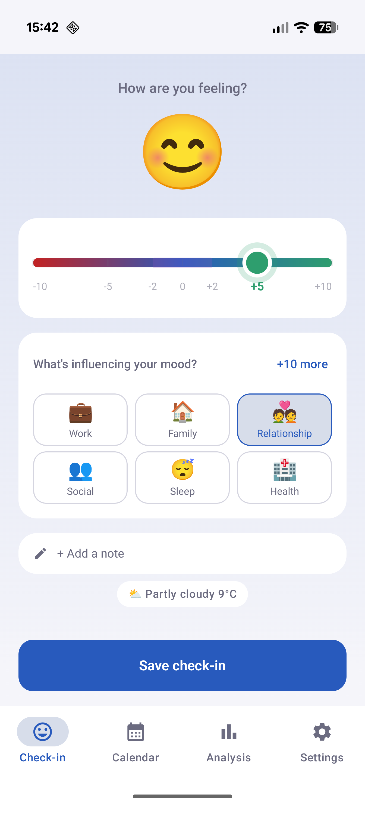
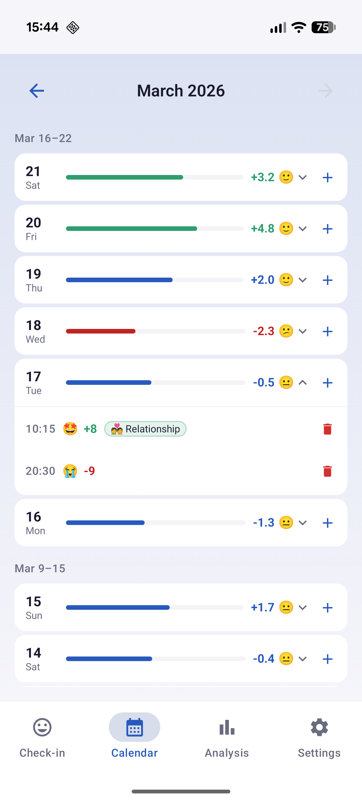
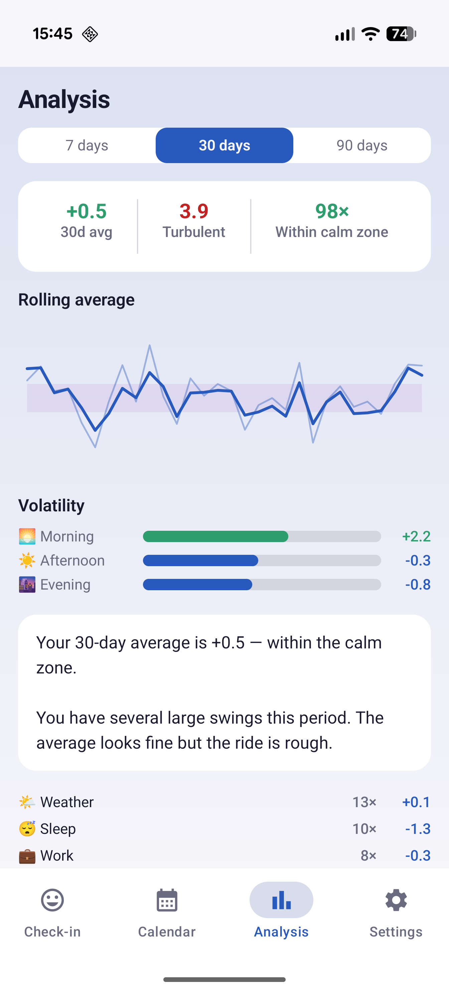
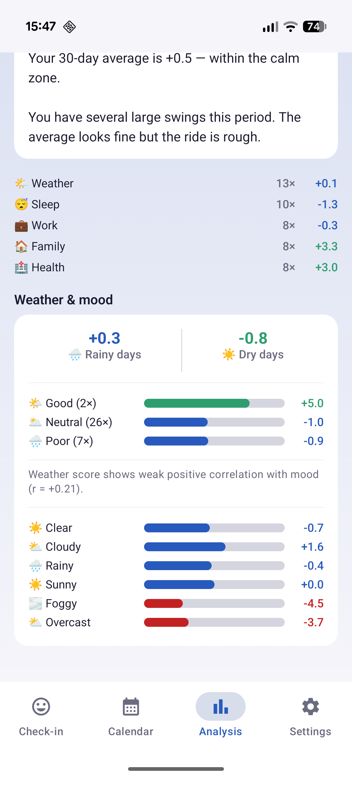
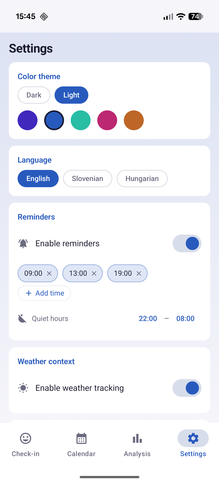

  
  <h1>MoodFox</h1>
  
<strong>Your mood. Your patterns. No nonsense.</strong>

  

    
    
    
    
  

---

MoodFox is a fast, private mood tracker for Android. Log how you feel several times a day on a **−10 to +10 scale**, tag causes, add a note, and let the app do the thinking. Over time you'll start to see patterns you didn't know existed — and probably some you'd rather ignore.

No cloud. No subscription. No fake AI psychology. Just your data, on your device.

---

## Screenshots

  
  &nbsp;
  
  &nbsp;
  
  &nbsp;
  
  &nbsp;
  

  Check-in &nbsp;·&nbsp; Calendar &nbsp;·&nbsp; Analysis &nbsp;·&nbsp; Weather correlation &nbsp;·&nbsp; Settings

---

## Features

- **Mood check-in** — drag the slider, pick a cause or two, add a note. Done in 5 seconds.
- **Calendar** — colour-coded overview of every day. Tap a day to see all entries, edit or add more.
- **Analysis** — trend line, rolling average, volatility score, time-of-day breakdown, top causes, and weather correlation. All in plain English, not therapy-speak.
- **Reminders** — set as many as you want, with quiet hours so your phone doesn't lecture you at 2am.
- **Weather context** — optional, uses [Open-Meteo](https://open-meteo.com/) (open API, no key needed). Only captured at check-in, never stored beyond the snapshot.
- **Backup & restore** — zip to Downloads, restore from zip. Export to Excel if you want to pivot-table your feelings.
- **Themes** — 5 colour accents × dark/light = 10 combinations. Yes, you can make it purple.
- **Languages** — English, Slovenian, Hungarian.

---

## The goal isn't +10

MoodFox actively discourages "mood hacking" toward constant highs. A calm, stable average between **−2 and +2** with low volatility is the healthy target. Chasing peaks is as worth noticing as ignoring prolonged lows.

---

## Privacy

- No account, no sign-in, no server.
- All data lives in Room DB on your device.
- Weather uses your location only at the moment of check-in — not stored, not sent anywhere else.
- Backup zips stay in your Downloads folder.

---

## Download

Grab the APK from the [latest release](https://github.com/mezga0153/MoodFox/releases/tag/v1.0.0) and sideload it, or wait for the Play Store listing.

---

## Tech stack

| Thing | Version |
|---|---|
| Kotlin | 2.3.0 |
| Jetpack Compose + Material 3 | BOM 2026.01.01 |
| Room | 2.8.4 |
| Hilt | 2.57.2 |
| Ktor (weather) | 3.0.3 |
| minSdk | 28 (Android 9) |
| targetSdk | 36 (Android 16) |

Architecture: local-first, no ViewModels, DAOs straight into composables. Controversial but it works.

---

## License

[Apache 2.0](LICENSE)
